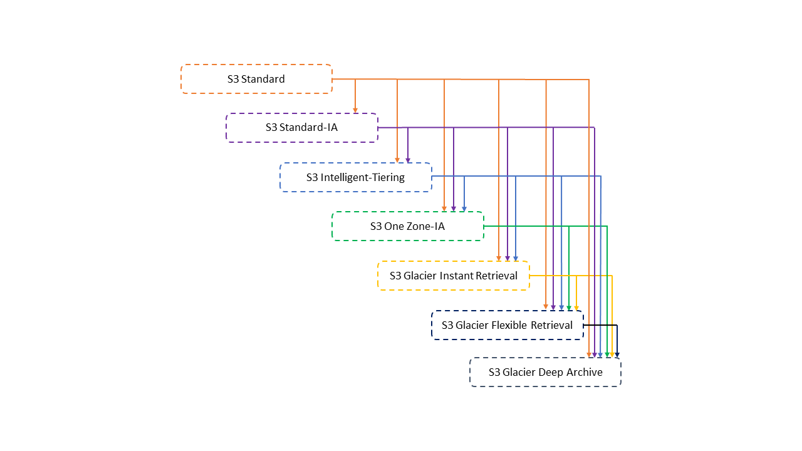

# S3

`S3は耐久性と可用性が非常に高く、データの中長期保存に最適なストレージ`

## S3 のユースケース

`コンテンツ配信用の画像データなどをS3に保存して、CloudFrontを利用して配信する`

## S3 ストレージの特徴

- ブロックストレージ
  - EC2 にアタッチして活用するディスクサービス
  - ブロック形式でデータを保存
  - 高速・広帯域幅
  - 例：EBS、インスタンスストア
- オブジェクトストレージ
  - 安価かつ高い耐久性をもつオンラインストレージ
  - オブジェクト形式でデータを保存
  - デフォルトで複数 AZ に冗長化されている
  - 例：S3、Glacier
- ファイルストレージ
  - 複数の EC2 インスタンスから同時にアタッチ可能な共有ストレージサービス
  - ファイル形式でデータを保存
  - 例：EFS

## S3 のデータ容量制限

**バケット**

オブジェクトの保存場所。リージョンに設置されるため、名前はグローバルでユニークにする。`データの保存容量は無制限であり、自動でストレージ容量が拡張される。`

**オブジェクト**

S3 に格納されるファイル形式で、オブジェクトに対して URL が付与される。バケット内に`保存可能なオブジェクト数は無制限。`

**保存可能なオブジェクトサイズの制限**

オブジェクトあたりのデータサイズは`0KBから5TBまで保存可能。`

## S3 の利用コスト

`ストレージのコストを比較するとインスタンスストアを除けば、最も値段が安いのはGlacier deep archive`

- S3 のデータ容量に応じたコスト
  - 標準：1GB あたり 0.025USD/月
  - S3 Intelligent Tiering：標準と標準 IA の組合せ
  - 標準 IA：1GB あたり 0.019USD/月
  - One Zone IA：1GB あたり 0.0152USD/月
  - Glacier：1GB あたり 0.005USD/月
  - Glacier deep archive：1GB あたり 0.002USD/月
- EBS の汎用ストレージのコスト
  - 汎用：1GB あたり 0.12USD/月
  - コールド HDD：1GB あたり 0.03USD/月
- EFS ストレージのコスト
  - 標準：1GB あたり 0.36USD/月
  - 低頻度アクセス：0.0272USD/月
- インスタンスストア
  - EC2 インスタンスに含まれる

## リクエスタ支払い

`S3バケットはデータ取得の際にも料金が発生する場合があるため、リクエスタ支払いはデータ取得したアカウントに課金する`

|                      |               データ保存コスト               |                                      データ通信コスト                                      |
| :------------------: | :------------------------------------------: | :----------------------------------------------------------------------------------------: |
| リクエスタ支払い無効 | バケットの所有者がデータ保存のコストを支払う |               バケットの所有者がデータのダウンロードコスト（通信料）を支払う               |
| リクエスタ支払い有効 | バケットの所有者がデータの保存コストを支払う | データダウンロードをリクエストしたアカウントがデータのダウンロードコスト（通信料）を支払う |

## S3 の保管データの暗号化

S3 へのデータ保管時に暗号化形式として以下の 4 つの形式から選択する

| 暗号化方式                      | 特徴                                                                                                                                                                                                              |
| ------------------------------- | ----------------------------------------------------------------------------------------------------------------------------------------------------------------------------------------------------------------- |
| SSE-S3                          | ・S3 の標準暗号化方式で簡易に利用可能 ・暗号化用のマネージドキーの作成、管理を S3 側で自動で実施 ・ブロック暗号化の 1 つである 256 ビットの Advanced Encryption Standard（AES-256）を使用してデータを暗号化 |
| SSE-KMS                         | ・AWS KMS に設定したキーを利用した暗号化を実施 ・ユーザー側で AWS KMS を利用して暗号化用のマネージドキーを作成、管理することが可能 ・AES-256 を利用                                                         |
| SSE-C                           | ・ユーザーが指定した暗号化用のマネージドキーをデータと共に送付して、サーバー暗号化（SSE-C）を実施する ・利用設定や管理が煩雑になるのがデメリット                                                               |
| クライアントサイド暗号化（CSE） | ・クライアント側の暗号化では、Amazon S3 に送信する前にデータを暗号化する方式 ・アプリケーションに保存したマスターキーを使用                                                                                    |

## S3 のアクセス管理

`S3のアクセス管理にはユーザーベースのIAMとリソースベースのバケットポリシーとACLを主に利用する`

| 管理方式             | 特徴                                                                                                                                                                          |
| -------------------- | ----------------------------------------------------------------------------------------------------------------------------------------------------------------------------- |
| IAM ユーザーポリシー | ・IAM ユーザーに対して AWS リソースとしての S3 へのアクセス権限を設定 `・内部のIAMユーザーやAWSリソースへの権限管理`                                                       |
| バケットポリシー     | ・バケットのアクセス権を JSON で設定する。 `・外部ユーザーやアプリケーションなども管理可能`                                                                                |
| ACL                  | ・バケット/オブジェクト単位でのアクセス権限を XML で設定することができる `・オブジェクトに個別に設定可能`                                                                  |
| アクセスポイント     | ・S3 バケットにアクセスポリシーを設定する ・バケットのアクセス権を JSON で設定する。1 つのバケットに対して複数設定可能 `・外部ユーザーやアプリケーションなども管理可能` |

## S3 のバージョン管理

`ユーザーによる誤操作でデータ削除などが発生してもバージョンから復元できる`

**バージョニングの基本**

- バケット単位でオブジェクトのバージョンを管理する
- バージョンごとにオブジェクトが保管される
- ライフサイクルルールによってバージョンが保存される期間を設定できる
- バージョニングが有効になる前のバージョンは null となる

## ストレージクラスの選択

S3 の用途に応じてストレージタイプを選択する

| タイプ                 | 特徴                                                                                                                                                                                                                          | 性能                                             | 追加課金                                                   |
| ---------------------- | ----------------------------------------------------------------------------------------------------------------------------------------------------------------------------------------------------------------------------- | ------------------------------------------------ | ---------------------------------------------------------- |
| STANDARD               | ・複数箇所にデータを複製するため耐久性が非常に高く、頻繁に利用するデータを大量に保存するのに向いている。 ・データは 3 つの AZ 以上で分散保存される                                                                         | ・耐久性：99.999999999% ・可用性：99.99%      | ・最低利用料金：なし ・データ取得料：なし               |
| STANDARF-IA            | ・IA は Infrequency Access の略であり、低頻度アクセスデータ用のストレージ。One Zone-IA より重要なマスターデータ向け。データ取得は早い ・Standard に比べて安価だが、One Zone-IA よりは高い。                                | ・耐久性：99.999999999% ・可用性：99.9%       | ・最低利用料金：30 日分 ・データ取得料：GB あたり取得料 |
| One Zone-IA            | ・低頻度アクセス用のストレージだが、マルチ AZ 分散されていないため可用性が低く、重要ではないデータ向け。その分 Standard-IA よりも値段が安い。                                                                                 | ・耐久性：99.999999999% ・可用性：99.5% = 1AZ | ・最低利用料金：30 日分 ・データ取得料：GB 当たり取得料 |
| S3 Intelligent Tiering | ・高頻度と低頻度という 2 つのアクセス階層を利用し、アクセスがあるファイルは高頻度（標準クラス）に維持しつつ、アクセスがないファイルは低頻度（標準 IA クラス）に自動で移動する。 ・アクセスパターンがわからない場合に利用。 | ・耐久性：99.999999999% ・可用性：99.9%       | ・最低利用料金：30 日分 ・データ取得料：なし            |

## S3 Intelligent-Tiering

`アクセス頻度に応じてオブジェクトを自動的に低コストのアクセス層に移動することでコストを削減する`

## S3 のパフォーマンス

### マルチパートアップロード

`大容量オブジェクトをいくつかに分けてアップロードする機能`

### S3 Transfer Acceleration

`データ転送元から地理的に 1 番近いエッジロケーションを利用して高速にデータアップロードを実施する`

## 静的 WEB ホスティング

`S3を利用して簡易な静的WEBサイトを作ることができる機能。S3バケットに保存されたhtmlファイルをWEBサイトとして表示。`

### 静的 WEB ホスティングメリット

- サーバーなしに WEB サイトをホスティング可能
- サーバーが必要ないため値段が安い
- マルチ AZ の冗長化を勝手にしてくれており、運用要らず
- Route53 で独自ドメインを設定可能
- CloudFront による配信可能

### 静的 WEB ホスティングデメリット

- サーバーサイドスクリプト言語を実行するなどの動的サイト不可
- 単独では SSL が利用できず、SSL 設定には CloudFront が必要

### 設定手順

1. ブロックパブリックアクセスを無効化する
2. バケットポリシーでバケットの読み取り許可を設定する
3. index.html などのインデックスドキュメントをバケット内に保存する
4. 静的 WEB ホスティングの設定画面で index.html などのインデックスドキュメントを設定し、有効化する

## S3 のライフサイクル管理

`時間に応じてオブジェクトのストレージクラスの変更や削除を自動的に行うルールを設定できる`

## S3 のレプリケーション

`S3バケットはレプリケーションによって別のバケットにデータを複製することができる`

### 同一リージョンレプリケーション（SSR）

- 同一リージョンのバケットに同じデータを保存する
- 本番用のデータとテスト用のデータと分ける際などにレプリケーションしてバケットを複数設定

### 別リージョンのレプリケーション（CRR）

- 別リージョンのバケットに同じデータを保存する
- 災害対応としてデータを別リージョンに保存
- リージョン別のアクセスを低レイテンシーにする

## クロスリージョンレプリケーション

`S3はリージョン間を跨ぐクロスリージョンレプリケーションにより耐障害性を高める`

### レプリケーションのトリガー

- レプリケーションを有効後に、バケットにおけるオブジェクトの作成・更新・削除をトリカーにレプリケーションを実行する
- 有効前のデータはレプリケーションされない

### 設定

- 事前にバージョニング機能を有効にする必要がある
- レプリケーション先となるバケットは別リージョンに設置
- 双方向レプリケーションも可能
- データ転送費用が発生
- レプリケーションは 3 つ目のバケットには連鎖しない

## S3 のクロスアカウントアクセス

`別のアカウントのIAMユーザーやロールからのアクセスを許可する設定`

| 設定方式                                  | 詳細                                                                                                                                                                                                                                         |
| ----------------------------------------- | -------------------------------------------------------------------------------------------------------------------------------------------------------------------------------------------------------------------------------------------- |
| バケットポリシーと IAM ポリシーによる許可 | ・S3 バケットへのアクセスを許可する IAM ポリシーを設定する ・IAM ユーザーとロールに IAM ポリシーを設定する ・S3 バケットへのクロスアカウントアクセスを許可する場合はバケットポリシーでアカウントを指定して許可を行う                   |
| ACL と IAM ポリシーによる許可             | ・S3 バケットへのアクセスを許可する IAM ポリシーを設定する ・IAM ユーザーとロールに IAM ポリシーを設定する ・S3 バケットの特定オブジェクトへのクロスアカウントアクセスを許可する場合は ACL でアカウントを指定して許可を設定            |
| IAM ロールによる許可                      | ・IAM ロールの権限移譲を利用して、S3 バケット/オブジェクトへのプログラムによるアクセスまたはコンソールアクセス用のクロスアカウントの IAM ロールを設定する ・AssumeRole の実行を許可したロールにより別アカウントのユーザーに権限を委譲する |

## S3 の利用状況分析

`S3バケットの利用状況を分析することで、効率的な利用方法や安全な利用がされているかを支援する`

| 分析機能                | 特徴                                                                                                                                                                             |
| ----------------------- | -------------------------------------------------------------------------------------------------------------------------------------------------------------------------------- |
| S3 サーバーアクセスログ | ・バケットに対するリクエストの詳細が記録される ・アクセスのログ情報は、セキュリティやアクセスの監査に利用できる                                                               |
| S3 アクセスアナライザー | ・S3 バケットに対して任意のユーザーや他の AWS アカウント（組織外の AWS アカウントを含む）にアクセスを許可が適切になされているかを評価、警告する                                  |
| S3 ストレージクラス分析 | ・データのアクセス頻度の分析 ・バケット内の一定期間のストレージアクセスパターンを分析し、標準ストレージに格納されたデータを標準 IA ストレージクラスに移行すべきかを判断できる |
| Amazon S3 Storage Lens  | ・データの使用状況とアクティビティの分析 ・バケットの使用状況とアクティビティのメトリクスを集計することができる                                                               |

## S3 データの分析

`S3内のデータ検索・解析には用途に応じて複数サービスから選択が可能`

| 分析サービス                  | 特徴                                                                                                                                                                               |
| ----------------------------- | ---------------------------------------------------------------------------------------------------------------------------------------------------------------------------------- |
| S3 Select (Glacier Select) | ・S3 の内部機能として有している検索機能で、S3 内で直接クエリを実行し、データをフィルタリングして取得できる ・GZIP 圧縮データや CSV や JSON に対して実行可能                     |
| Amazon Athena                 | ・Amazon S3 内のデータを直接、簡単に分析できるようにするインタラクティブなクエリサービス ・Athena SQL クエリで SageMaker 機械学習モデルを呼び出し、機械学習による推論も実行可能 |
| Amazon Macie                  | ・機械学習により Amazon S3 の機密データを検出、分類、保護する、フルマネージド型サービス ・機密データ検出や調査を実施する                                                        |
| AMazon Redshift Spectrum      | ・Amazon S3 の格納テーブルに対して、Amazon Redshift から直接クエリを実行できる機能 ・Redshift クラスターが起動されている前提であるため、Redshift を利用している場合におすすめ   |

## Amazon S3 Glacier

`バックアップなど中長期保存用のS3よりも安価なストレージ`

### 特徴

- Amazon S3 Glacier では、データは「アーカイブ」に保存される
- 1 つのアーカイブの最大サイズは 40TB
- 保存可能なアーカイブ数とデータ量に制限なし
- 各アーカイブには作成時に一意のアーカイブ ID が割り当てられ、作成後はアーカイブを更新できない
- アーカイブを保存するためのコンテナとして「ボールト」を使用（1 つの AWS アカウントでは、最大 1000 個のボールトを使用）
- Amazon S3 のライフサイクルルールと連携させることにより、Amazon S3 データのアーカイブを自動化し、全体的なストレージコストを削減
- Advanced Encryption Standard(AES)256 ビット対称鍵を使用してデフォルトで自動的に暗号化
- S3 と違って直接データをアップロード・取得という処理ができないため、S3 ライフサイクル管理からか、プログラム処理によるアップロード/ダウンロードが必要
- Glacier の最低保持期間は 90 日

### Glacier の仕組み

`S3と異なり、ボールトとアーカイブという単位でデータを保持`

| 管理方式   | 特徴                                                                                                                                      |
| ---------- | ----------------------------------------------------------------------------------------------------------------------------------------- |
| ボールト   | ・ボールトはアーカイブを格納するコンテナ ・ボールトはリージョンに作成                                                                  |
| アーカイブ | ・アーカイブは、写真、動画、ドキュメントなどの任意のデータで、S3 Glacier でのストレージの基本単位 ・各アーカイブは一意のアドレスを持つ |
| ジョブ     | ・アーカイブに SELECT クエリを実行したり、アーカイブを取得したり、ボールトのインベントリを取得したりする実行単位                          |
| 通知設定   | ・ジョブの完了には時間がかかるため、ジョブの完了時に SNS と連携した通知設定が可能                                                         |

### Glacier のデータ抽出タイプ

`Glacierのデータ取得タイプの設定に応じて、データ取得時間と取得時の料金が変わる`

| タイプ                       | 特徴                                                                                                                                                                    |
| ---------------------------- | ----------------------------------------------------------------------------------------------------------------------------------------------------------------------- |
| 迅速                         | 迅速取り出しでは、アーカイブのサブセットが迅速に必要になった場合にデータに素早くアクセスするモード。通常 1~5 分以内で使用可能になる。                                   |
| プロビジョニングキャパシティ | プロビジョンドキャパシティーは、迅速取り出しの取得容量を必要なときに利用できることを保証する仕組み                                                                      |
| 標準                         | 標準取り出しでは、数時間以内にすべてのアーカイブにアクセスできるデフォルト設定。通常、標準取り出しは 3~5 時間で完了                                                     |
| 大容量                       | 大容量取り出しは、最も安価な取り出しオプションであり、大量データ（ペタバイトのデータを含む）を 1 日以内に低コストで取得できる。通常、大容量取り出しは 5~12 時間で完了。 |

### ストレージクラスの選択

Glacier では 3 つのストレージタイプから選択する

| タイプ                                        | 特徴                                                                                                                                                                                                                                                               | 性能                                        | 追加課金                                                    |
| --------------------------------------------- | ------------------------------------------------------------------------------------------------------------------------------------------------------------------------------------------------------------------------------------------------------------------ | ------------------------------------------- | ----------------------------------------------------------- |
| S3 Glacier Flexible Retrieval(通常の Glacier) | ・1 年に 1~2 回アクセスされ、非同期で取り出されるアーカイブデータ向け ・通常のデータ検索で 3~5 時間を要する ・迅速取り出しで 2~5 分で取り出し可能 ・一括検索(5~12 時間)で無料 ・ライフサイクルマネジメントで指定 ・ボールトロック機能でデータを保持 | ・耐久性：99.999999999% ・可用性：99.99% | ・最低利用料金：90 日分 ・データ取得料：GB 当たり取得料  |
| S3 Glacier Instant Retrieval                  | ・アクセスされることがほとんどなく、ミリ秒単位の取り出しが必要な長期間有効なデータ向け ・医用画像やニュースメディアなど ・S3 Standard と同じパフォーマンスのミリ秒単位でのデータ取り出し                                                                     | ・耐久性：99.999999999% ・可用性：99.9%  | ・最低利用料金：90 日分 ・データ取得料：GB 当たり取得料  |
| Amazon Glacier Deep Archive                   | ・最安のアーカイブ用ストレージ ・7~10 年以上保持される長期間使用されるものの、滅多にアクセスされないデータ向け ・標準の取り出し速度で 12 時間以内にデータ取得 ・大容量取り出しで 48 時間以内にデータ取得 ・ライフサイクル管理で指定                    | ・耐久性：99.999999999% ・可用性：99.99% | ・最低利用料金：180 日分 ・データ取得料：GB 当たり取得料 |

### アクセス管理

Glacier のアクセス管理は用途に応じて方式を使い分ける
|管理方式|特徴|
|-|-|
|IAM ポリシー|・IAM ユーザーやリソースに対して S3 サービスへのアクセス権限を設定する ・一元的にリソースへのアクセス権限を管理|
|ボールトポリシー|・ボールトで直接アクセスポリシーを定義して、組織内のユーザーや社外ユーザーに対してもボールトへのアクセス権を付与|
|データ取り出しポリシー|・データ取り出しに関する制限を定義 ・無料利用枠のみに制限。または無料利用枠を超える量を取り出したい場合は、最大取得率を指定すると、取り出し速度を制限して、取り出しコストの上限を設定|
|ボールトロックポリシー|・ロックによって変更を禁止することにより、コンプライアンス管理を強力に実施することが可能|
|署名|・認証保護のために、全リクエストに署名が必要|

### Amazon Glacier の料金

#### 容量当たりの料金

GB/月あたり 0.005USD（0.5 円ほど）

`→S3は標準で0.025USD、One Zoneで0.0152USD/GB`

#### データ取り出し料金

- 迅速：0.033USD/GB
- 標準：0.011USD/GB
- 大容量：0.00275USD/GB

#### データ取り出しリクエスト料金

- 迅速：11.00USD/リクエスト 1000 件
- 標準：0.0571USD/リクエスト 1000 件
- 大容量：0.00275USD/リクエスト 1000 件

#### プロビジョニングされた迅速取り出し

110.00USD/プロビジョンド容量単位

#### データ転送料金

データ転送（イン）は無料。インターネットへのデータ転送（アウト）は 1GB/月まで無料。それ以上は有料

※すべて 2020 年 7 月時点での価格。
