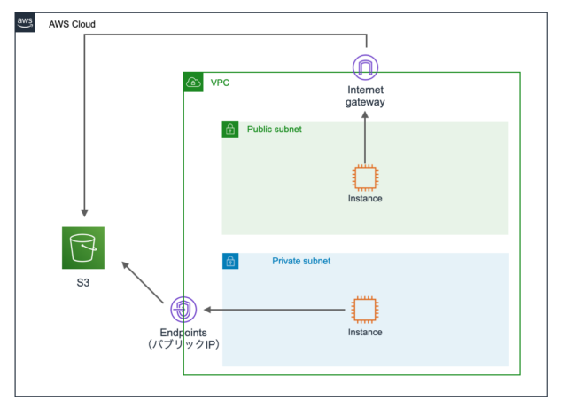

# VPC

`VPCはAWSクラウドのネットワークからユーザー専用の領域を切り出すことができる仮想ネットワークのサービス`

- リージョン内に 5 つまで VPC を設定可能（上限緩和申請可能）
- 任意の IP アドレス範囲（CIDR）を選択して仮想ネットワークを構築
  - 最小サイズは/28
  - 最大サイズは/16
- VPC はプライベート IP アドレスによってネットワークレンジを設定
- サブネットの作成、ルートテーブルやネットワークゲートウェイの設定などにより、仮想ネットワーキング環境を完全に制御できる
- 必要に応じてクラウド内外のネットワーク同士を接続したり、外部のネットワークと接続することが可能
- 1 つの VPC と 1 つのサブネットが採用構成。単一サブネットが AZ の範囲に設定される
- 同一リージョン内では、VPC は複数の AZ にリソースを含めることが可能

## CIDR

CIDR に/16 を設定した際に設定可能となるサブネット数と IP アドレスの組み合わせ（AWS 管理 IP の 5 つを引いたもの）

| サブネットマスク | 利用可能な IP アドレス数 |
| :--------------: | :----------------------: |
|       /16        |          65536           |
|       /18        |          16384           |
|       /20        |           4096           |
|       /22        |           1024           |
|       /24        |           356            |
|       /16        |            54            |
|       /28        |            16            |

## サブネット

- サブネットは VPC 内に複数設定でき、1 つの AZ を指定して配置される。（パブリックとプライベートがある）
- インターネットゲートウェイへのルーティング有無でサブネットのタイプが分かれる。
- インターネットに公開される WEB サイトやアプリをパブリックサブネットに、セキュリティを高めたい DB をプライベートサブネットに置くという構成が一般的。
- プライベートサブネット内のインスタンスにインターネットから接続するには踏み台サーバーが必要。（インターネットに返信を返すには NAT ゲートウェイが必要）

## ゲートウェイの設定

VPC コンソールで作成・管理できるゲートウェイは以下。

### インターネットゲートウェイ

- インターネットへの出入り口となるゲートウェイ
- デフォルトゲートウェイとして利用されることが多い
- インターネットゲートウェイを VPC に 1 つ設定する

### NAT ゲートウェイ

- プライベートサブネットのリソースからインターネットへのトラフィックを可能にするためのゲートウェイ
- プライベートアドレスをパブリックアドレスに変換して、インターネットゲートウェイに連携させる

### Egress-Only Internet Gateway

- IPv6 向けのインターネットゲートウェイ
- IPv6 経由での VPC からインターネットへの送信を可能にし、インターネットからのインスタンスへの接続は防ぐ

### カスタマーゲートウェイ

- オンプレミス環境と接続する際に利用するゲートウェイ
- カスタマーゲートウェイデバイスまたはソフトウェアアプリケーションに関する情報を AWS に提供する

### 仮想プライベートゲートウェイ

- 仮想プライベートゲートウェイは、VPC トンネルの Amazon 側にあるルーター
- VPN 接続時に利用する

## ポート番号

通信する出入り口となっているのがポート番号で、メールボックスのような役割を担っている。

- HTTP 通信：80 番
- HTTPS 通信（暗号化）：443 番
- LINE：5000 番 / 5528 番
- SSH 通信：22 番
- メール通信（SMTP）：25 番
- メール受信（POP）：110 番、143 番

## セキュリティグループ

`インスタンスへのトラフィックのアクセス可否を設定するファイアーウォール機能を提供`

- インスタンス単位で適用
- 特定の VPC に紐づいて作成
- ステートフル：インバウンドのみ設定すればアウトバンドも許可される
- 許可のみを In/Out で指定
- デフォルトは全インバウンドが設定なし、アウトバンドが許可される
- 全てのルールを適用

## ネットワーク ACL

`VPCとサブネットへのトラフィックのアクセス可否を設定するファイアーウォール機能を提供`

- VPC/サブネット単位で適用
- ステートレス：インバウンド設定だけではアウトバンドは許可されない
- 許可と拒否を In/Out で指定
- デフォルトでは全ての通信を許可する設定
- 番号の順序通りに適用するため、重複したプロトコルに設定されている場合は小さい番号が優先される
- VPC 内のリソースにアクセスする際は、セキュリティグループとネットワーク ACL の両方の許可設定が必要

## Elastic IP

`Elastic IPは静的に利用できる追加のIPアドレス。インスタンスがインターネットへとアクセスするためには、パブリックIPかElastic IPを利用する。`

- パブリック IP
  - `動的`なパブリック IPv4 アドレス
  - インスタンスが停止した場合は IP アドレスが変更される
  - VPC でパブリック IP アドレスの割り当てが有効化されていれば、自動的に VPC 内リソースに割り当てられる。
  - 無料
- Elastic IP
  - `静的`なパブリック IPv4 アドレス
  - インスタンスが停止しても IP アドレスは変更されない
  - VPC コンソールにおいて Elastic IP を作成してから必要なサービスにアタッチする
  - 利用時は無料。解放せずに利用しないと有料になる

## VPC エンドポイント

`VPC エントポイントはインターネットを介さずにVPC内からVPC外のリソースへアクセスする機能`

(VPC 内に配置している EC2 インスタンスと、VPC 外に配置している S3 で通信するとインターネットを介すことになりデータ転送コストやセキュリティ上の問題が発生するため、VPC エンドポイントを使用する)

### ゲートウェイ型エンドポイント

- サポートされる AWS サービスを宛先とするトラフィックのルートテーブル宛先として指定できるゲートウェイ
- `DynamoDBとAmazon S3にのみ適用可能`
- サブネットに特殊なルーティングを設定し、VPC 内部から直接外のサービスと通信する
  - アクセス制御：エンドポイントポリシーを設定
  - 料金：無料
  - ゲートウェイがルーティング
  - 冗長性：AWS 側が対応
    

### プライベートリンク型エンドポイント（インターフェース型）

- サポートされるサービスを宛先とするトラフィックのエントリポイントとして機能するサブネットの IP アドレス範囲のプライベート IP アドレスを持つ Elastic Network Interface
- プライベート IP アドレスを使用してサービスにプライベートにアクセスする
- AWS PrivateLink は、VPC とサービス間のすべてのネットワークトラフィックを Amazon ネットワークに制限
- RDS、EC2 などの多くの AWS サービスに適用可能
- `2022 年より、Amazon S3 に対応。DynamoDB は未対応`
- サブネットにエンドポイント用のプライベート IP アドレスを生成し、DNS が名前解決でルーティング
  - アクセス制御：セキュリティグループを設定
  - 料金：有料
  - IP アドレスを介して接続
  - 冗長性：マルチ AZ 設計
    

## VPC Peering

`VPC Peeringにより2つのVPC間でのトラフィックルーティングが可能`

- 異なる AWS アカウント間の VPC 間をピア接続可能
- 一部のリージョン間の異なる VPC 間のピア接続も可能
- 単一障害点や帯域幅のボトルネックは存在しない
  

## VPC オンプレミス接続

`VPNの方が素早く利用できるが、信頼性や品質は専用線が勝る`

- AWS Direct Conect

  - オンプレミス環境から AWS プライベートネットワークへの専用ネットワーク接続を作成する

- AWS VPC
  - AWS サイト間 VPN
    - オンプレミス環境から AWS プライベートネットワークへの VPN 接続を作成する
  - AWS Client VPN
    - クライアントからの VPN 接続を実施するリモート接続用のサービス
    - オンプレミスと AWS 両方のアプリケーションへの安全なアクセスを提供
