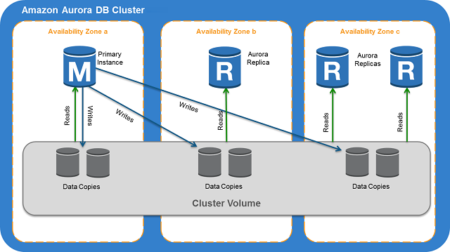
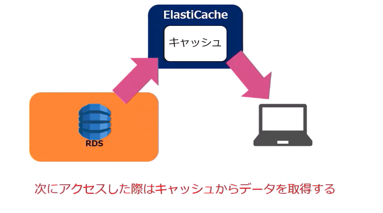
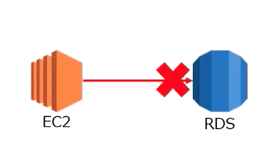
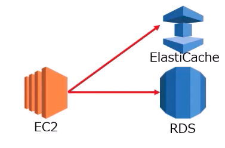

# データベース

## データベースの基礎

### リレーショナル DB(RDB)

`業務システム向けの DB の基本はリレーショナルデータベース`

#### 概要

- 業務システムなどで最も頻繁に利用されるオペレーション用のデータベース
- 利用者は SQL などのクエリ言語でデータ操作を実施

#### アーキテクチャ

- テーブル間のリレーションが定義されたデータモデル
- 行志向で 1 つの行をデータのかたまりとして取り扱う

#### 利用データ

- 会計データなどの業務系の構造化データ

#### AWS サービス

- RDS

### データウェアハウス（DWH）

`構造化データを利用した経営分析向けのデータベース`

#### 概要

- データの抽出・集約に特化した BO データ分析用のデータベース
- 読み込むデータ構造をあらかじめ設計して、加工してから利用分のデータを蓄積
- レスポンス重視でデータ抽出・集計が早いが、更新・トランザクションは遅い

#### アーキテクチャ

- データをパーティショニングして、複数ディスクから読み込む
- 列志向でデータを格納

#### 利用データ

- 会計データなどの業務系の構造化データを分析用に加工し、BI で利用
- KPI 測定/競合分析/アクセス分析など

#### AWS サービス

- Redshift

### 分散型 DB/データレイク

`ビッグデータやIoTデータを蓄積して高速処理を可能にするDBとストレージの組み合わせ`

#### 概要

- データ抽出に特化した DB
- 分散してデータを保存しており、ビッグデータの高速処理向け

#### アーキテクチャ

- SQL ライクなクエリで操作可能
- INSERT/UPDATE/DELETE はない
- トランザクションはない
- データ書き込みは一括ロードまたは全件削除のみ

#### 利用データ

- ビックデータ

#### AWS サービス

- S3

### KVS：キーバリュー型

`シンプルなデータ構造にすることで高速処理を可能にしたDB`

#### 概要

- 分散して、シンプルなオペレーションを高速に実施できる DB

#### アーキテクチャ

- 強い整合性を犠牲にして、結果的な整合性を採用
- 分散向けのデータモデル/クエリの採用
- トランザクション/集計/JOIN など不可

#### 利用データ

- 大規模 WEB サイトのバックエンドデータ（ユーザーセッション/ユーザー属性/事前計算データのキャッシュ）
- メッセージングシステムのデータ
- 大規模書き込みが必要な IoT センサーデータなど

#### AWS サービス

- ElastiCache
- DynamoDB

### ワイドカラム型

`キーに対してカラムを大規模に登録できるのがワイドカラム型`

#### 概要

- 分散して、シンプルなオペレーションを高速に実施できる DB
- データ取得する際にデータ結合しなくても済むように、可能な限り多くのデータを同じ行に保持

#### アーキテクチャ

- 結果整合性を採用
- キースペース、カラムファミリ、ロウ、（スーパーカラム）、カラムの入れ子構造
- SQL ライクなデータ操作が可能
- データの操作は挿入、削除、参照のみでデータの更新は挿入による上書き

#### 利用データ

- Facebook/Twitter などソーシャルデータの位置情報データストレージ/リアルタイム分析/データマイニング処理

#### AWS サービス

- DynamoDB

### ドキュメント DB

`キーに対してドキュメント指向でXMLなどのデータを格納する`

#### 概要

- ドキュメント指向データベースでは、様々なデータ構造のドキュメントを混在して保存することができる

#### アーキテクチャ

- JSON/XML をデータモデルに利用
- 小規模データの同期集計処理が可能だが、バッチは不向き
- SQL ライクなデータ操作が可能で、KVS よりもクエリが豊富なため操作しやすい
- Sharding によるデータベース分散化

#### 利用データ

- 半構造化データ（XML/JSON）
- 大規模 WEB のログ保管など
- オンラインゲームデータ
- カタログ管理

#### AWS サービス

- Amazon DocumentDB
- mongoDB

### インメモリデータグリッド

`KVSの仕組みをメモリを利用してより高性能にしたDB`

#### 概要

- 大量のデータを多数のサーバーのメモリ上で分散して管理する技術
- ミリ秒単位の高速の応答処理が可能

#### アーキテクチャ

- データをメモリ上に置くことで、高速なデータアクセスを実現
- データを多数のサーバーで分散して管理

#### 利用データ

- 金融の取引処理データでミリ秒以下の応答時間を実現

#### AWS サービス

- Redis ElastiCache
- Memcached ElastiCache

### 全検索型エンジン ✖︎ 分散 DB

`データの全検索エンジンであるElasticsearchは分散データベースと連携してデータ全検索処理が可能`

#### 概要

- 全検索型のデータ検索エンジンで、分散データベースと連携して検索データベースを構築
- 検索条件との関係性/関連性が高いデータを抽出して返す

#### アーキテクチャ

- Elasticsearch は全文検索用のライブラリ Apache Lucene を利用したデータストア
- 分析の柔軟性や速度が高く、分析/蓄積/可視化環境を容易に構築可能

#### 利用データ

- 構造化データ/非構造化データ
- 高可用な全検索エンジン
- サイト内データの検索
- デバイス登録状況・配信状況のリアルタイム可視化などリアルタイム検索要件/検索行動の可視化

#### AWS サービス

- Amazon OpenSearch Service

### グラフ DB

`グラフ構造でデータ間のつながりを検索・可視化するDB`

#### 概要

- グラフ演算に特化した DB で、データ間の繋がり方を検索・可視化に利用

#### アーキテクチャ

- グラフデータ構造をとるため、RDB 以上にスケールアウトができない
- レコード数が増えると、検索にかかる時間と難易度が増大
- ACID 特性が担保されており、オブジェクト間の関連づけを簡単に表現できる

#### 利用データ

- 最短経路検索
- 金融取引の詐欺検出
- ソーシャルネットワークによるリレーション計算

#### AWS サービス

- Amazon Neptune

### 分散 OLTP（RDB）

`オンライントランザクション処理（Online Transaction Processing）を分散化する次世代DB`

#### 概要

- グローバルに分散され、強整合性を備えたデータベース

#### アーキテクチャ

- リレーショナルデータベースの構造と非リレーショナルデータベースの分散スケーラビリティを兼ね備える
- 高い可用性、高性能のトランザクションと強整合性が実現

#### 利用データ

- 大規模な業務データ処理

#### AWS サービス

- Amazon Aurora

## DynamoDB の概要

### DynamoDB とは何か？

`ストリーミングデータを利用したリアルタイムデータ処理などに最適なデータベースとして利用するNoSQL型データベース`

【DynamoDB 活用例】

- IoT や WEB セッションなどのストリーミングデータを取得
- Lambda 関数がデータを前処理後 DynamoDB へとデータを蓄積
- DynamoDB のデータを利用して広告表示などに利用

### DynamoDB のできること

`キーバリュー（ワイドカラム型）でデータを簡易に操作することができる`

#### できること

- キーに対するバリュー（値）の CRUD 操作
- 簡易なクエリやオーダー
- 例えば、数万人以上が同時アクセスして処理が必要になるアプリケーションのセッションデータ処理など

#### できないこと/向いてないこと

- JOIN/TRANSACTION/COMMIT/ROLLBACK は不可
- 詳細なクエリやオーダー（データの検索や結合処理などには向いてない）
- 大量のデータ読み書きにはコストがかかる

### DynamoDB のユースケース

`ビッグデータ処理向けか大量データ処理が必要なアプリケーション向けに利用する`

#### ビッグデータ

- IoT データなど Key Value 型のシーケンシャルなデータを収集・蓄積・分析するのに最適
- Amazon EMR の Hadoop 処理と連携してビッグデータ処理が可能

#### アプリケーション

- セッションデータやメタデータなどのアプリケーション上でシンプルなデータを蓄積
- 高パフォーマンスな処理が必要なデータを保存

`大量に発生しうるWEB行動データやログデータの保存にはDynamoDBを利用する`

#### ユーザー行動データ管理

- ゲームのセッションデータや WEB サイトのユーザー行動データを保存・処理する
- ユーザーごとの行動履歴管理などに利用する

#### バックエンドデータ処理

- モバイルアプリのバックエンド/バッチ処理のロック管理/フラッシュマーケティング/ストレージのインデックス

| 比較項目                         | RDS | DynamoDB | ElastiCache | Redshift |
| -------------------------------- | --- | -------- | ----------- | -------- |
| リレーショナルデータベース       | ⚪︎ | ×        | ×           | ⚪︎      |
| データベースキャッシュ           | △   | ⚪︎      | ⚪︎         | ×        |
| メタデータ検索                   | ⚪︎ | ⚪︎      | ⚪︎         | ×        |
| セッションなどの状態管理         | △   | ⚪︎      | △           | ×        |
| 大容量データ分析                 | △   | ×        | ×           | ⚪︎      |
| リアルタイムデータ分析           | △   | ⚪︎      | ⚪︎         | ×        |
| 低レイテンシー                   | △   | ⚪︎      | ⚪︎         | ×        |
| モバイルバックエンドデータベース | △   | ⚪︎      | △           | ×        |

### DynamoDB の性能

`完全マネージド型のNoSQLデータベースサービスであり、テーブルサイズは無制限だが、1つのデータは400KBに制限`

#### パフォーマンス

- ハイスケーラブルで無制限に性能を拡張できる
- 負荷が高くなっても応答速度が低下しない低レイテンシー
- 高可用性（SPOF なしでデータは 3 箇所の AZ に保存）
- マネージド型のためメンテナンスフリー：CloudWatch で運用

#### データ容量の制限

- `ストレージの容量制限がない。`テーブルのサイズには実用的な制限はない。テーブルは項目数やバイト数について制限がない
- `データ項目には制限あり。`項目のサイズ制限は 400KB であり、大きなデータを格納できない。

### DynamoDB の性能

`1桁台のミリ秒レイテンシーを安定して実現しつつ、DAXを利用すればマイクロセカンド単位でのリクエスト処理が可能`

- DynamoDB テーブル：1 桁のミリ秒レイテンシーを実現
- DAX：1 秒あたりのリクエスト数が数百万件になる場合でも、ミリセカンドからマイクロセカンドへ向上

### DynamoDB の整合性モデル

デフォルトで結果整合性モデルであり、一部処理に強い整合性モデルを利用している

#### Write

- 少なくとも 2 つの AZ での書き込み完了が確認取れた時点で終了

#### Read

- デフォルト：結果整合性モデル

最新の書き込み結果が即時読み取り処理に反映されない可能性がある

- オプション：強い整合性モデル

GetItem/Query/Scan では強い整合性のある読み込みオプションが指定可能

### テーブル設計

DynamoDB はテーブル単位から利用が開始され、テーブル → 項目 → 属性と設計する

#### テーブル

DynamoDB のテーブルはデータのコレクションのこと。他の DB と同様にテーブル単位にデータを保存する

#### 項目（アイテム）

各テーブルの中に項目を作ってデータを作成する。項目間で一意に識別可能な属性グループとなる。Personal という項目を作成すれば、名前や ID などが属性として付属する

#### 属性

各項目は 1 つ以上の属性で構成される。属性はそれ以上分割する必要がない最小のデータ単位。例えば Personal 項目には、姓名といった名前の属性を設定する

### キャパシティモードの設定

利用するキャパシティが予測できるか否かでモードを選択

#### オンデマンドモード

- 利用するキャパシティが予測できないときに選択するモード
- トラフィック量の予測が困難な場合にリクエストの実績数に応じて課金
- オンデマンドで Read/Write 処理に自動スケーリングを実施

#### プロビジョニングモード

- 利用するキャパシティが事前予測できるときに選択するモード
- 事前に予測した書き込みキャパシティユニット（WCU）と読み込みキャパシティユニット（RCU）を設定する
- 設定したキャパシティに基づいて課金
- UpdateTable オペレーションを使用して、必要な回数だけ ReadCapacityUnits または WriteCapacityUnits を増やすことができる
- キャパシティ容量に近づくと HTTP400 コード（不正なリクエスト）と ProvisionedThroughputException が発せられる

### DynamoDB の料金

キャパシティ設定の方式と利用する機能に応じて課金される

#### オンデマンド

- ストレージ容量（GB 単位）
- 書き込み単位
- 読み込み単位

#### プロビジョン度

- ストレージ容量（GB 単位）
- 書き込みキャパシティーユニット（WCU）
- 読み込みキャパシティーユニット（RCU）

#### その他

- グローバルテーブル：レプリケート書き込みキャパシティーユニット（rWCU）
- DynamoDB Accelerator（DAX）：ノード時間単位
- DynamoDB ストリーム：ストリーム読み込みリクエスト単位

### インデックス

DynamoDB は暗黙的に設定する KVS における Key に値するものと、明示的に設定するキーがインデックスとして利用できる

#### 暗黙的なキー

データを一意に特定するために暗黙的にキー（ハッシュキーやレンジキー）として宣言して検索に利用するインデックスで、1 テーブルに 1 つ宣言する

#### 明示的なキー

- ローカル・セカンダリ・インデックス（LSI）はプライマリキーのタイプがハッシュキーやレンジキーの場合に追加で別のレンジキーを増やすようなイメージ。1 テーブルに 5 つ作成可能/テーブル作成時に作成。
- グローバル・セカンダリ・インデックス（GSI）は別のハッシュキーを設定することができる。全データに対してグローバルに付与。1 テーブルに 5 つ作成可能/テーブル作成後に作成。

### プライマリーキー

DynamoDB はハッシュキーとレンジキーという 2 種類のプライマリーキーを利用する

#### ハッシュキー

- KVS におけるキーに相当するデータを一位に特定するための ID などのこと
- テーブル作成時に 1 つの属性を選び、ハッシュキーとして宣言
- ハッシュ関数によってパーティションを決定するためハッシュキーと呼ぶ
- ハッシュキーは単独での重複を許さない

#### レンジキー

- ハッシュキーにレンジを加えたものをレンジキーまたは複合キーと呼ぶ
- て０ブル作成時に 2 つの属性を選び、1 つをハッシュキーとして、もう一つをレンジキーと呼ばれるキーとして宣言
- 2 つの値の組み合わせによって、1 つの項目を特定
- 複合キーは、単独であれば重複が許される

### セカンダリインデックス

ハッシュキーやレンジキーだけでは検索要件が満たせない場合に LSI と GSI を追加する

#### Local Secondary Index(LSI)

- ソートキー以外にインデックスを作成できる検索方式
- 複合キーテーブルにのみ設定可
- 複合キーによって整理されている項目に対して、パーティションキーを指定した上で、別の規則のインデックスとなりクエリ検索に利用できる

#### Glabal Secondary Index(GSI)

- GSI はインデックス用に新たにパーティションキーとソートキーを指定する検索方式
- ハッシュキーテーブル及び複合キーテーブルどちらにでも設定可能
- ハッシュキーの代わりになるため、ハッシュキーを跨いで物理パーティションにとらわれない検索が可能

※どちらもスループットやストレージ容量を追加で必要で、書き込みも増大するため多用するべきではない

### DynamoDB ストリーム

DynamoDB テーブルに保存された項目の追加・変更・削除の発生時の履歴をキャプチャできる機能

#### データの保存

- 過去 24 時間以内のデータ変更の履歴を保存し、24 時間を経過すると消去される
- データ容量はマネージド型で自動的に管理

#### データ保存の順番

- 操作が実施された順番に応じてデータはシリアライズされる
- 特定のハッシュキーに基づいた変更は正しい順番で保存されるが、ハッシュキーが異なる場合は受信した順番が前後される可能性がある

### バックアップとリカバリ

パフォーマンスに影響なく数百 TB のバックアップを実施

- オンデマンドバックアップ
  - 任意のタイミングでテーブルの完全なバックアップを作成する
  - 長期間の保存とアーカイブを実施
- ポイントインタイムリカバリ
  - 連続バックアップを有効化して、バックアップを継続的に実施する。そのため、任意のタイミングでリカバリできる。
  - 過去 35 日間の任意の時点にテーブルを復元することができる

## Aurora の概要

### Aurora とは何か？

`マルチAZで分散されたクラスター構成により、高速・高性能なリレーショナルデータベース`

クラウド時代の新しい分散型のリレーショナルデータベースとして誕生

### Aurora の特徴

`高い並列処理性能によって大量の読み書きをするのに適したDB`

- 高い並列処理によるストレージアクセスによってクエリを高速処理することが可能
- Aurora は大量の書き込みや読み込みを同時に扱うことができる
- データベースの集約やスループット向上が見込まれる
- ただし、すべてが 5 倍高速というわけではなく、適用すべき領域を見つけて利用する

`分散型で耐障害性と自己回復性を備えたスケーラブルな新しいタイプのフルマネージド型RDB`

#### 耐障害性/自己回復性

- 3 つの AZ に 2 つのコピーを設置可能で合計 6 つのコピーを保持
- 過去のデータがそのまま S3 に継続的にバックアップ
- リストアも差分適用がなく高速
- どのタイミングでも安定したリストア時間を実現
- 99.99%の高可用性・高耐久性

#### スケーラビリティ

- 10GB から最大 64TB を提供する SSD データプレーンを利用してシームレスに拡張可能
- Auto-Scaling などのクラウド独自のスケーラブルが可能
- 最大 15 のリードレプリカを利用した高速の読み込みが可能

### Aurora のユースケース

大規模なクエリ処理が発生する RDB 環境などは Aurora への移行を検討すべし

#### 大規模なクエリデータ処理

- 書き込み量が多くて、トランザクション量が多い
- クエリ並行度が高い、データサイズが大きいケースで効果を発揮する
- コネクション数やテーブル数が多いデータベース処理

#### 運用の容易さを活用する

- スケーラビリティの高さやデータ容量が無制限に拡張できる
- レプリケーションなどの性能の高さ

## Redshift の概要

### Redshift とは何か？

`AWS上にデータウェアハウスを構築することができるマネージド型サービス。高速でスケーラブルな費用対効果の高いマネージド型DWH`

- データ分析用のリレーショナルデータベースであり、OLTP には利用負荷
- 数百ギガバイトのデータから開始して、ペタバイト以上まで拡張
- 1 テラバイトあたり年間 1,000USD 以下で利用可能
- 自動ワークロード管理など自動テーブルメンテナンスなど多くのメンテナンスタスクやデータ配置が自動化されているフルマネージド型
- PostgreSQL 互換の列指向データモデルであり、列ベースでデータを保存
- 複数ノードをまとめたクラスター構成。マルチ AZ 構成も可能になった。
- 大規模並列クエリ実行によって高パフォーマンスを達成
- AQUA による分散キャッシュで、Redshift が他のクラウドデータウェアハウスに比べて最大 10 倍の速度で動作
- RA3 インスタンスで最大で他のクラウドデータウェアハウスの 3 倍に達するパフォーマンス

### ノードタイプ

利用するデータサイズやケースに応じてノードタイプを選択

#### RA3

- 高性能コンピューティングとスケーリングされるストレージを利用する DWH
- コンピューティングをストレージから別にスケーリングできる柔軟性
- データ量の増大が予想される場合に推奨
- ホットデータには高性能の SSD を使用し、コールドデータには S3 を使用

#### Dense Storage(DS2) 高密度ストレージ

- 固定ローカル SSD ストレージを使用した低コスト DWH
- 3 年間のリザーブドインスタンスを購入すると HDD ベースの低コストで利用可能
- 未圧縮で 1TB 未満のデータセットでは DC2 ノードタイプの利用を推奨

#### Dense Compute(DC) 高密度コンピューティング

- 高いスループットと低いレイテンシーを必要とする DWH ワークロード用
- 高速 CPU、大容量 RAM、SSD(Solid-State Disk)を使用
- データが 500GB を超える場合に最適

## ElactiCache の概要

### ElastiCache とは何か？

`ElastiCacheはメモリにキャッシュを保持して、高速処理を実施するインメモリデータベース`

### ElastiCache の特徴

`分散インメモリキャッシュサービスの構築・管理及びスケーリングを容易に実施することができるサービス`

- キャッシュクラスタを数クリックで起動
- フルマネージド型でモニタリング、自動障害検出、復旧、拡張、パッチ適用、バックアップに対応し高可用性を実現
- 広く利用されている 2 種類のエンジン memcached, redis から選択可能

### ユースケース

`データアクセスを高速にしたいケースがあればキャッシュの活用を検討する`

- セッション管理
- IoT 処理とストリーム処理
- メタデータ蓄積
- ソーシャルメディアのデータ処理/分析
- Pub/Sub 処理
- DB キャッシュ処理

`アプリケーションでデータの即時反映が必要なケースなどに活用する`

- ユーザーのマッチング処理
- レコメンデーションの結果処理
- 画像データの高速表示
- ゲームイベント終了時のランキング表示

### ElastiCache の構成

`キャッシュすべきデータを特定して、他のDBと合わせて利用するのが標準的な構成方法`

#### キャッシュ未使用パターン

DB アクセス負荷が増大すると処理能力が低下し可用性が低下する

#### インメモリキャッシュ利用パターン

アクセス頻度の高いデータをキャッシュに配置して可用性を高める

### セキュリティ対応

ElastiCache Redis はデータ転送時の暗号化、データ保管時の暗号化および Redis Auth による認証を実施することが可能

#### 保管時の暗号化

- AWS KMS により、データ同期やバックアップオペレーションの実行中にオンディスクデータが暗号化される
- 対象は同期・バックアップ・スワップ処理中のディスクと Amazon S3 に保存されているバックアップデータ

#### 通信の暗号化

- Redis と Memcached で TLS 暗号化を実施できる
- データ転送時（クラスターのノード間、クラスターとアプリケーション間など）に暗号化を実施

#### Redis Auth

- Redis 認証トークンを使用して、クライアントがコマンド実行前にトークン（パスワード）を要求して認証を実施する
